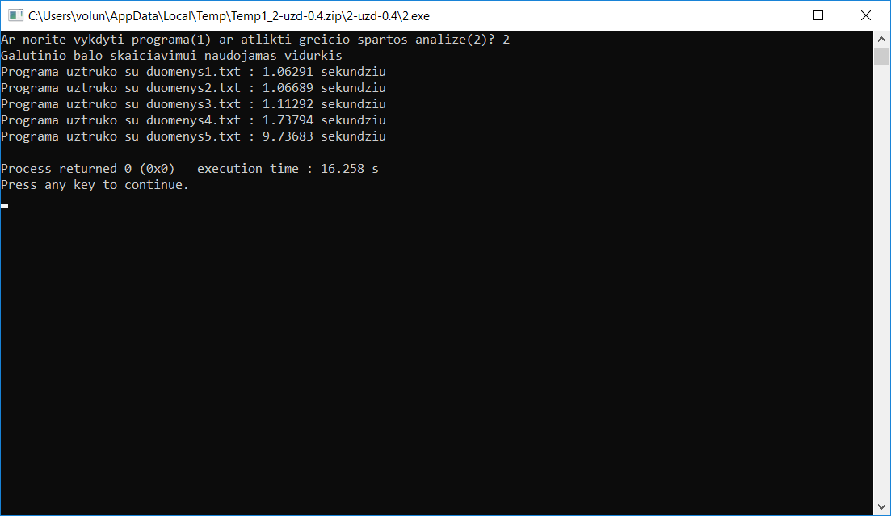
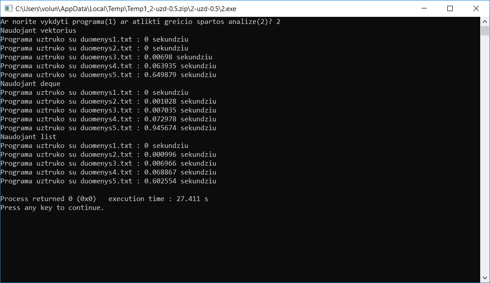
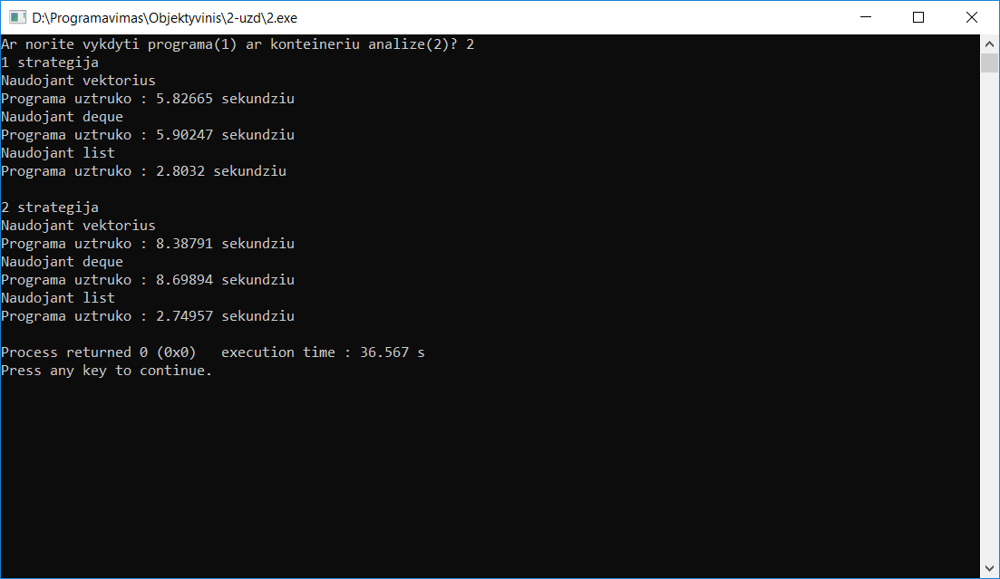

# 2-uzd Duomenų apdorojimas

 ## Programos tikslas
 Pagal įvestus arba nuskaitytus iš failo duomenis (namų darbų ir egzamino rezultatus) programa paskaičiuoja studentų galutinį balą.
 
 ## Paleidimas
 Naudojant CMake failą
 
 ## Versijų istorija
 ### [v0.1](https://github.com/karas245/2-uzd/releases/tag/v0.1)
 - Sukurta programa
 ### [v0.2](https://github.com/karas245/2-uzd/releases/tag/v0.2)
 - Galimybė skaityti duomenis iš failo
 ### [v0.3](https://github.com/karas245/2-uzd/releases/tag/v0.3)
 - Pridėti header ir cpp failai į kuriuos yra perkeltos funkcijos
 ### [v0.4](https://github.com/karas245/2-uzd/releases/tag/v0.4)
 - Pridėtas 5 failų generavimas 
 - Studentai rušiuojami į dvi kategorijas ir rezultatai išvedami į du naujus failus
 - Pridėta programos greičio spartos analizė
 ### 
 ### [v0.5](https://github.com/karas245/2-uzd/releases/tag/v0.5)
 - Pridėtas konteinerių testavimas
 ### 
### [v1.0](https://github.com/karas245/2-uzd/releases/tag/v1.0)
- Konteinerių testavimas pagal 2 strategijas
- Pridėti README.md ir CMakeList.txt failai
### 
### [v1.1](https://github.com/karas245/3-uzd/releases/tag/v1.1)
- Vietoj struct naudojama class
```
Compiler flags
01 
1 strategija Programa uztruko : 4.62947 sekundziu
2 strategija Programa uztruko : 4.41805 sekundziu

02
1 strategija Programa uztruko : 4.75927 sekundziu
2 strategija Programa uztruko : 4.43813 sekundziu

03
1 strategija Programa uztruko : 4.77208 sekundziu
2 strategija Programa uztruko : 4.42716 sekundziu
```
### 
